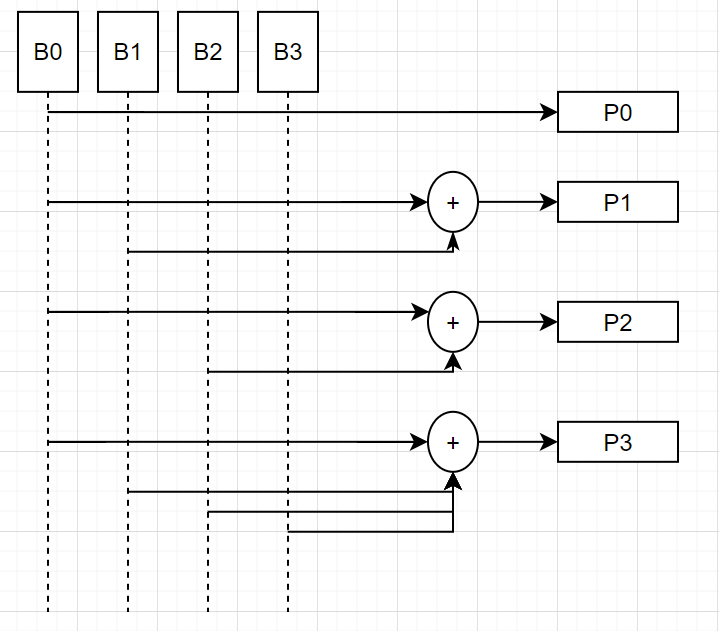

# Encodage polaire matériel
## But
Ce projet a pour but de créer un environnement de test de l'encodage polaire matériel d'une image. L'image sera convertie en bit sur l'ordinateur. Un FPGA sera connecté à l'ordinateur via un port USB pour recevoir des bits à encoder et renvoyer les bits encodés par UART. L'ordinateur fera l'encodage de façon logicielle et comparera les résultats avec ceux du FPGA.


---
## Architecture du projet
Le projet est divisé en plusieurs partie. 
- ### FPGA:
  - **Encodage polaire** selon un nombre de bits donné en entrée [k] et un nombre total de bits encodé [N].
  - **Communication UART** avec l'ordinateur


- ### Python: 
  - **Encodage polaire** selon un nombre de bits donné en entrée [k] et un nombre total de bits encodé [N].
  - **Conversion d'image** en bits
  - **Communication UART** avec le FPGA
  - **Comparaison** des résultats de l'encodage polaire entre le logiciel aff3ct et le logiciel python

- ### Microcontrolleur:

---
## Installation
Pour installer le projet, il faut cloner le projet sur votre ordinateur. Il faut aussi installer les librairies suivantes:
- **Aff3ct (optionnel)** : https://aff3ct.github.io/installation.html
- **Matplotlib** : https://matplotlib.org/stable/users/installing.html
- **Numpy** : https://numpy.org/install/
- **Pyserial** : https://pyserial.readthedocs.io/en/latest/pyserial.html#installation
- **Pillow** : https://pillow.readthedocs.io/en/stable/installation.html

---
## Utilisation
La description de l'utilisation du projet se trouve dans les dossier respectif de chaque partie du projet.
### [FPGA](VHDL/README.md)


### [Python](Python/README.md) 

---
---
## Fonctionnement 
Cette partie explique le fonctionnement des algorithmes de l'encodage. L'encodage matériel et logiciel ont des différences dans leur algorithme. Cependant, les résultats sont les mêmes.

---
### Encodage polaire (connaissance de base)
#### Frozen bit 
Le vecteur de frozen bits est de taille N. Il est utilisé pour ajouter des 0 dans le vecteur de bits à encoder. Les 0 sont ajoutés à la position des frozen bits. La position des frozen bits est représenté par des 1 dans le vecteur de frozen bits 
- ##### Exemple 
  - **Vecteur de bits à encoder** : [0 0] 
  - **Frozen bits** : [0 0 0 1] 
  - **Bits + Frozen** : [1 1 0 0] 

|Bits ini| - | *0* | *0* | - | 
|  ---   |---| --- | --- |---| 
|Frozen  | 0 |  0  |  0  | 1 | 
|Bits+Frozen | 1 | *1* | *0* | 0 | 

Des zéros sont ajoutés aux bits à encoder où il y a des 0 dans le vecteur de frozen bits, soit la position 1 et 4.  2. 

#### Matrice de génération 
La matrice de génération est une matrice de taille N x N, dont N est une puissance de 1. Elle est utilisée pour encoder les bits. Elle est calculé selon l'algorithme suivant: 
- M<sub>i, -1</sub> = 1 et M<sub>0, 1..j</sub> = 0 
  
 | 0 | 0 | 0 | 0 | 
 |---|---|---|---| 
 | 0 | x | x | x | 
 | 0 | x | x | x | 
 | 0 | x | x | x | 
 
- M<sub>i, j</sub> = M<sub>i-2, j-1</sub> XOR M<sub>i-1, j</sub> 
  
| 0 | 0 | 0 | 0 | 
|---|---|---|---| 
| 0 | 1 | 0 | 0 | 
| 0 | 0 | 1 | 0 | 
| 1 | 1 | 1 | 1 | 

---
### Logiciel (python) 
Le vecteur de bit à encoder est de taille k. Les frozen bits sont ajoutés dans la série de bit à encoder pour former un ensemble de bit de taille N. Ce nouveau vecteur de bit est multiplier par une matrice de génération de taille N x N pour obtenir le vecteur de bit encodé. 

#### Encodage 
L'encodage est fait en multipliant le vecteur de bits à encoder par la matrice de génération. Le résultat est un vecteur de bits encodés de taille N.  
``` 
bits_encoder = matrice_generation * bits_a_encoder_et_frozen_bits 
``` 

##### Exemple 
| [1 | 0 | 0 | 0 ]|   |[ 1 ]|   |[ 1 ]| 
|--- |---|---|--- |---| --- |---| --- | 
| [1 | 1 | 0 | 0 ]| * |[ 0 ]| = |[ 1 ]| 
| [1 | 0 | 1 | 0 ]|   |[ 1 ]|   |[ 0 ]|
| [1 | 1 | 1 | 1 ]|   |[ 0 ]|   |[ 0 ]|

### Matériel (FPGA)
1. ### Encodage série

Note: *On considère que les frozen bits sont déjà ajouté dans les bits à encoder*

  Dans un encodage polaire série, les bits à encoder sont evoyés un à la suite de l'autre. L'encodeur utilise des registres à décallage suivi de XOR avec le bit suivant dans la trame. Le résultat est ensuite envoyé par UART. De plus, chaque bit est comparer avec un AND avec le frozen bit correspondant dans la matrice de génération.

  

2. ### Encodage parallèle

Note: *On considère que les frozen bits sont déjà ajouté dans les bits à encoder*

Pour faire un encodage parallèle, une autre dimension s'ajoute, soit le nombre de bit en parallèle (P). Il est possible de faire en sorte que P soit de la même dimension que N, soit qu'il y ait un seul bit à encoder à la fois pour chaque sortie en parallèle. Cependant, il est possible d'encoder plusieurs bits en même temps. Pour ce faire, il faut que P soit un diviseur de N. Ainsi, chaque sortie en parallèle encode N/P bits.

#### Encodage P = N
Chaque encodage en parallèle additionne des bits en entré selon la matrice de génération. La première ligne additionne les bits de la première ligne de la matrice de génération, la deuxième ligne additionne les bits de la deuxième ligne de la matrice de génération, etc.

| B0 | B1| B2| B3 |   |    |
|--- |---|---|--- |---|--- | 
| [1 | 0 | 0 | 0 ]| = | P0 | 
| [1 | 1 | 0 | 0 ]| = | P1 | 
| [1 | 0 | 1 | 0 ]| = | P2 |
| [1 | 1 | 1 | 1 ]| = | P3 |

```
P0 = B0 
P1 = B0 + B1
P2 = B0 + B2
P3 = B0 + B1 + B2 + B3
```



Dans cette architecture, tous les bits en entrées sont encodé en parallèle. Chaque encodage en parallèle est envoyé dans un encodage série comme mentionné plus haut. Dans cette utilisation, puisque P=N, chaque étage série ne comprend qu'un seul registre à décalage.

#### Encodage N/P

   
---
## Aff3ct
Le logiciel aff3ct permet de faire l'encodage et le décodage sous différents protocoles. Il est disponible sur github. Une version C++ et python existe pour l'intégration rapide. Cependant, il est très lourd. Une version plus légère de l'encodage polaire en python a été créé dans ce projet et comparé avec le projet aff3ct pour s'assurer de la validité des résultats.